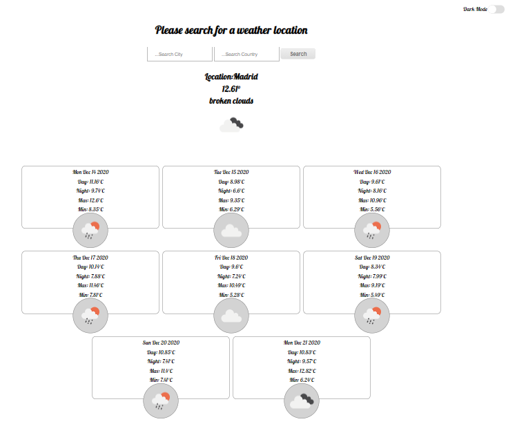
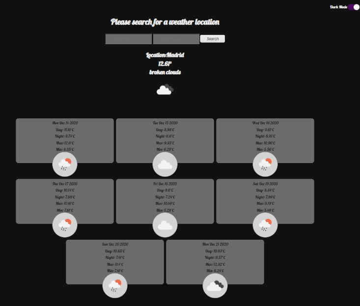

##Weather App Project

7 weeks in to CodeNation bootcamp sees us starting to use some more advance web develop features and tools.

We were tasked with using [Open Weather Map](https://openweathermap.org/) API to develop a weather app, this app would use two API calls to fetch the current weather for your specified location as well as an 8 day forecast. I went a step further to make an additional API call to fetch the country codes that are required to make the 8 day forecast using [Rest Countries](https://restcountries.eu/), this helps to improve the UX.

To bring all of this together we would be using NodeJs to handle our backend & Axios to make dealing with our API calls easier.

I had time to implement a dark mode for those of us with sensitive eyes!

